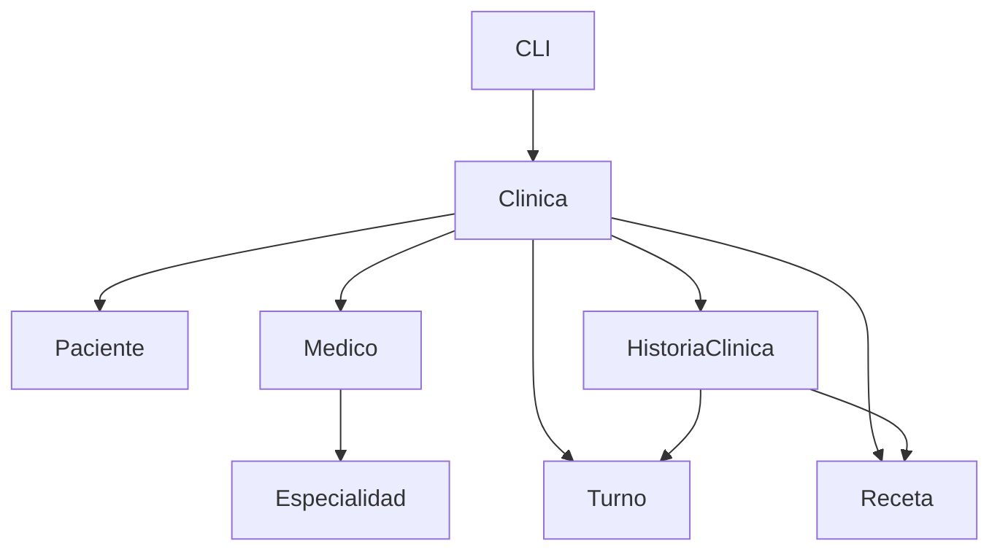

# Documentación del Sistema de Gestión para una Clínica

## 📋 Descripción del Proyecto

Sistema de gestión integral para una clínica médica desarrollado en Python utilizando programación orientada a objetos. Permite la administración completa de pacientes, médicos, turnos, recetas e historias clínicas.

## 🏗️ Estructura del Proyecto

```
├── src/
│   ├── __init__.py
│   ├── modelo/
│   │   ├── __init__.py
│   │   ├── paciente.py          # Clase Paciente
│   │   ├── medico.py            # Clase Medico
│   │   ├── especialidad.py      # Clase Especialidad
│   │   ├── turno.py             # Clase Turno
│   │   ├── receta.py            # Clase Receta
│   │   ├── historia_clinica.py  # Clase HistoriaClinica
│   │   ├── clinica.py           # Clase principal Clinica
│   │   └── excepciones.py       # Excepciones personalizadas
│   └── interfaz/
│       ├── __init__.py
│       └── cli.py               # Interfaz de línea de comandos
├── tests/
│   ├── __init__.py
│   ├── test_paciente.py         # Tests unitarios para Paciente
│   ├── test_medico.py           # Tests unitarios para Medico
│   ├── test_especialidad.py     # Tests unitarios para Especialidad
│   ├── test_turno.py            # Tests unitarios para Turno
│   ├── test_receta.py           # Tests unitarios para Receta
│   ├── test_historia_clinica.py # Tests unitarios para HistoriaClinica
│   ├── test_clinica.py          # Tests unitarios para Clinica
│   └── test_integration.py      # Tests de integración
├── main.py                      # Punto de entrada del sistema
├── requirements.txt             # Dependencias del proyecto
└── README.md                    # Documentación del proyecto
```

## 🚀 Cómo Ejecutar el Sistema

### Prerequisitos

- Python 3.8 o superior
- pip (gestor de paquetes de Python)

### Instalación

1. **Clonar o descargar el proyecto**
   ```bash
   # Si tienes el proyecto en un repositorio
   git clone <url-del-repositorio>
   cd sistema-clinica
   ```

2. **Instalar dependencias**
   ```bash
   pip install -r requirements.txt
   ```

### Ejecución

**Opción 1: Ejecutar desde el directorio raíz**
```bash
python main.py
```

**Opción 2: Ejecutar como módulo**
```bash
python -m src.interfaz.cli
```

### Uso del Sistema

Al ejecutar el sistema, aparecerá un menú interactivo con las siguientes opciones:

```
--- Menú Clínica ---
1) Agregar paciente
2) Agregar médico
3) Agendar turno
4) Agregar especialidad
5) Emitir receta
6) Ver historia clínica
7) Ver todos los turnos
8) Ver todos los pacientes
9) Ver todos los médicos
0) Salir
```

#### Flujo de Trabajo Recomendado:

1. **Registrar médicos** con sus especialidades y días de atención
2. **Registrar pacientes** con sus datos personales
3. **Agendar turnos** respetando disponibilidad y especialidades
4. **Emitir recetas** después de las consultas
5. **Consultar historias clínicas** para seguimiento

## 🧪 Cómo Ejecutar las Pruebas

### Ejecutar Todas las Pruebas

**Con unittest (incluido en Python):**
```bash
# Desde el directorio raíz del proyecto
python -m unittest discover tests -v
```

**Con pytest (más detallado):**
```bash
# Instalar pytest si no está instalado
pip install pytest

# Ejecutar todas las pruebas
pytest tests/ -v

# Ejecutar con reporte de cobertura
pytest tests/ -v --cov=src
```

### Ejecutar Pruebas Específicas

**Tests unitarios por módulo:**
```bash
python -m unittest tests.test_paciente -v
python -m unittest tests.test_medico -v
python -m unittest tests.test_clinica -v
```

**Tests de integración:**
```bash
python -m unittest tests.test_integration -v
```

**Ejecutar un test específico:**
```bash
python -m unittest tests.test_integration.TestIntegracion.test_flujo_completo_atencion_medica -v
```

### Cobertura de Tests

Los tests cubren:
- ✅ **Tests unitarios**: Cada clase del modelo por separado
- ✅ **Tests de integración**: Funcionamiento conjunto del sistema
- ✅ **Casos exitosos**: Operaciones normales del sistema
- ✅ **Casos de error**: Validaciones y excepciones
- ✅ **Casos límite**: Situaciones extremas y validaciones

## 🏛️ Explicación del Diseño General

### Arquitectura del Sistema

El sistema sigue una **arquitectura en capas** con separación clara de responsabilidades:

#### 1. **Capa de Modelo (src/modelo/)**
Contiene toda la lógica de negocio y las entidades del dominio:

- **`Paciente`**: Representa a los pacientes con datos básicos
- **`Medico`**: Representa a los médicos con sus especialidades
- **`Especialidad`**: Define especialidades médicas y días de atención
- **`Turno`**: Representa citas médicas programadas
- **`Receta`**: Representa prescripciones médicas
- **`HistoriaClinica`**: Historial médico completo de cada paciente
- **`Clinica`**: Clase coordinadora principal del sistema
- **`excepciones`**: Excepciones personalizadas del dominio

#### 2. **Capa de Interfaz (src/interfaz/)**
- **`CLI`**: Interfaz de línea de comandos para interactuar con el usuario

#### 3. **Capa de Pruebas (tests/)**
- Tests unitarios para cada clase del modelo
- Tests de integración para verificar el funcionamiento conjunto

### Patrones de Diseño Implementados

#### **1. Encapsulación**
- Atributos privados con métodos de acceso controlado
- Validaciones en los métodos públicos
- Ocultación de la implementación interna

#### **2. Separación de Responsabilidades**
- **Modelo**: Lógica de negocio y validaciones
- **CLI**: Presentación e interacción con usuario
- **Tests**: Verificación de funcionalidad

#### **3. Manejo de Excepciones**
```python
# Excepciones personalizadas para diferentes tipos de errores
PacienteNoEncontradoException
MedicoNoDisponibleException
TurnoOcupadoException
RecetaInvalidaException
```

#### **4. Agregación y Composición**
- `Clinica` agrega `Pacientes` y `Medicos`
- `HistoriaClinica` compone `Turnos` y `Recetas`
- `Medico` agrega `Especialidades`

### Flujo de Datos



### Validaciones Implementadas

#### **Validaciones de Negocio:**
- ✅ Turnos solo en días que el médico atiende
- ✅ Especialidades válidas por médico
- ✅ No duplicación de turnos (mismo médico, fecha/hora)
- ✅ Existencia de pacientes y médicos antes de operaciones
- ✅ Recetas con medicamentos válidos

#### **Validaciones de Datos:**
- ✅ Formatos de fecha válidos
- ✅ DNI y matrículas únicas
- ✅ Campos obligatorios completos

### Características Técnicas

#### **Gestión de Memoria:**
- Uso de diccionarios para búsquedas eficientes O(1)
- Listas para datos ordenados cronológicamente
- Copias defensivas en métodos de acceso

#### **Extensibilidad:**
- Fácil agregar nuevas especialidades
- Posibilidad de extender funcionalidades sin modificar código existente
- Estructura modular para futuras mejoras

#### **Robustez:**
- Manejo completo de errores con excepciones específicas
- Validaciones exhaustivas en todas las operaciones
- Tests comprensivos que cubren casos normales y extremos

## 📊 Ejemplos de Uso

### Registro de un Médico con Especialidades
```python
# Crear especialidades
pediatria = Especialidad("Pediatría", ["lunes", "miércoles", "viernes"])
cardiologia = Especialidad("Cardiología", ["martes", "jueves"])

# Crear médico
medico = Medico("Dr. Juan Pérez", "MP001")
medico.agregar_especialidad(pediatria)
medico.agregar_especialidad(cardiologia)

# Registrar en la clínica
clinica.agregar_medico(medico)
```

### Agendamiento de Turno
```python
# Fecha para un lunes (día que atiende pediatría)
fecha_turno = datetime(2025, 6, 23, 10, 0)

# Agendar turno
clinica.agendar_turno("12345678", "MP001", "Pediatría", fecha_turno)
```

### Consulta de Historia Clínica
```python
historia = clinica.obtener_historia_clinica("12345678")
print(f"Turnos: {len(historia.obtener_turnos())}")
print(f"Recetas: {len(historia.obtener_recetas())}")
```

## 🔧 Configuración de Desarrollo

### Variables de Entorno
No se requieren variables de entorno especiales para este proyecto.

### Dependencias
Consultar `requirements.txt` para la lista completa de dependencias.

## 📝 Notas Adicionales

- El sistema maneja fechas en formato español para días de la semana
- Las validaciones se realizan en el modelo, no en la interfaz
- Todos los datos se mantienen en memoria durante la ejecución
- El sistema es thread-safe para operaciones básicas

## 🐛 Solución de Problemas

### Errores Comunes

1. **ModuleNotFoundError**: Verificar que se ejecuta desde el directorio correcto
2. **Turnos no se agendan**: Verificar que el médico atiende esa especialidad ese día
3. **Tests fallan**: Verificar que todos los archivos están en la estructura correcta

### Contacto
Para reportar problemas o sugerencias, consultar con el equipo docente.
